# <h1> S10 - EJERCICIOS

Construcción de figuras simples con las primitivas de GLUT
# <h2> Ejercicio 1
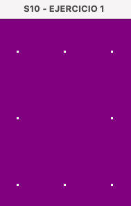

# <h2> Ejercicio 2
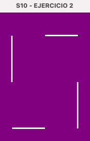

# <h2> Ejercicio 3
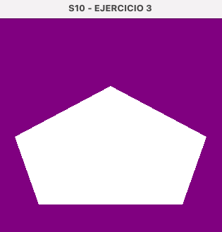

# <h2> Ejercicio 4
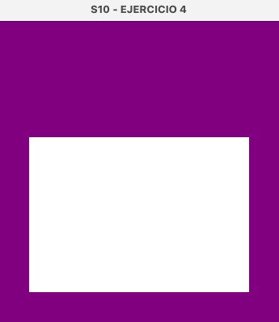

# <h2> Ejercicio 5
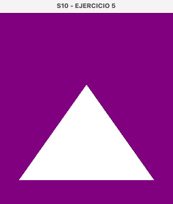

# <h2> Ejercicio 6
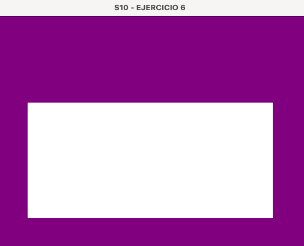

# <h2> Ejercicio 7
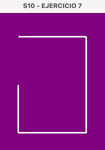

# <h2> Ejercicio 8
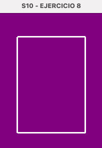

# <h2> Ejercicio 9

# <h2> Ejercicio 10
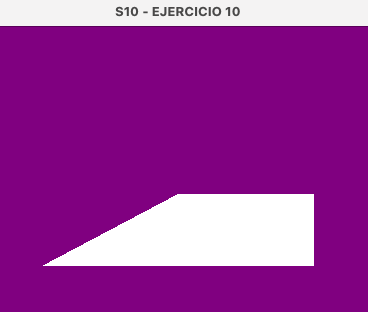

# <h2> Ejercicio 11
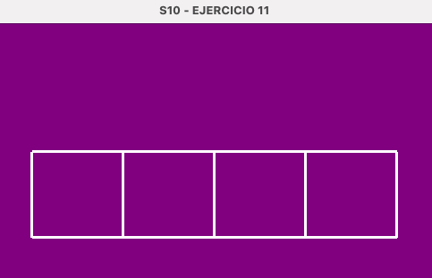

# <h2> Ejercicio 12
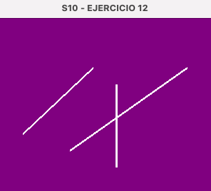